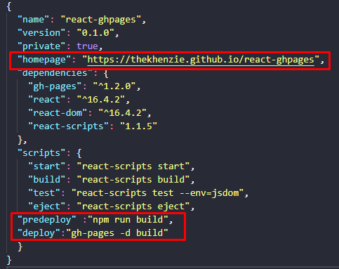
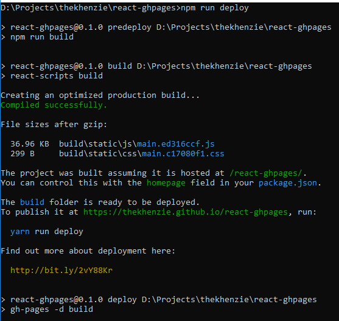

React and Github Pages
===

While I'm enhancing my blog site, out of curiosity, I wonder if a React app can also be hosted in Github Pages. I thought of ReactJS because I'm using it as a front-end framework on my work now together with ASP.NET as back-end. Of course, I did some research and yes, it is possible. So I'll share with you guys how do I do it.  

---
First, let me show you an introduction for the technologies we will use:

- [React](https://reactjs.org/) - A JavaScript library for building interfaces.
- [Git](https://github.com/git/git) - A fast, scalable, distributed revision control system.
- [Github](https://github.com/about) - Web-based Git. Largest development platform.
- [Github Pages](https://pages.github.com/) - Gives hosting for repositories' static websites on Github.
- [NodeJS](https://nodejs.org/) - A JavaScript run-time environment that executes JavaScript code outside of a browser.
- [npm](https://www.npmjs.com/) - A package manager for JavaSciprt and word's largest registry.
---

I will assume that NodeJS and Git are already installed in your system, if not go ahead and install with the given links above.

Let start!

1. Since I'll just demo how to host a React App in Github pages; I will use the boilerplate, [create-react-app](https://github.com/facebook/create-react-app), created by [Facebook](https://fb.me).

On your Node.JS command prompt, enter the following command.

```javascript
$ npm install -g create-react-app
```

2. After installing the module, let's create a project. I will name it "*react-ghpages*".

```javascript
$ create-react-app react-ghpages
```

3. Once installed, open your project folder and run the app.

```javascript
$ cd react-ghpages
$ npm start
```

4. Open http://localhost:3000 to view it in the browser. After the page is loaded, let's proceed on creating the repository in Github.

5. Go to your Github account and create a new repository. I named my repository the same as the project. 


6. After creating the repository, let's go back to the project folder. In order to push the codes to Github, we'll initialize the project folder first.

```javascript
$ git init
$ git add .
$ git commit -m "Initial commit"
```

7. Let's now push the code to your Github repository created a while ago. It will create a master branch and will add the codes into it. Just don't forget to replace the *username* and *repo-name* with your own.

```javascript
$ git remote add origin https://github.com/<username>/<repo-name>.git
$ git push origin master
```

8. Your codes are now online thanks to Github. We'll install another package name "*gh-pages*" to manage our Github pages.

```javascript
$ npm install gh-pages --save
```

9. After installing, let's modify the **package.json** file by adding the following statements. Make sure to replace the *username* and *repo-name* with your own. 

```
https://<username>.github.io/<repo-name>
```



10. To deploy, run the script on your package.json

```javascript
$ npm run deploy
```



Once published, you can now visit your site.


---
Even though Github pages only supported static websites, we can easily deploy a React app by compiling it for building purposes. **Webpack** is reponsible for it since it bundles Javascript files for usage in browser. **Gh-pages** module on the other hand creates a new branch, "gh-pages" under the repository, pushes the file there, and modifying your repository settings, making the Github Pages environment complete.